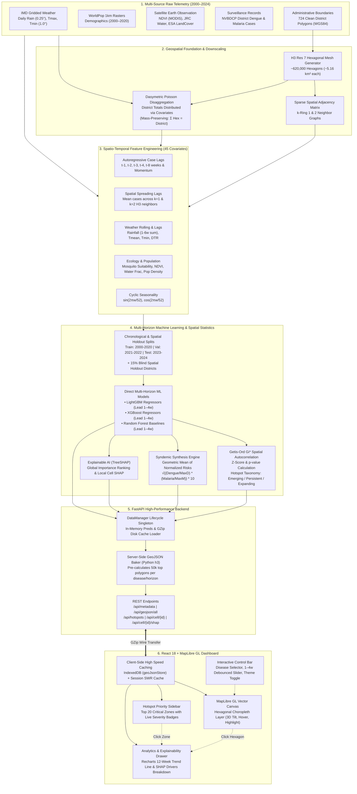

# VectorHotspot: Comprehensive Presentation Script & System Architecture Guide

> **File Name**: `hitler.md`  
> **Project Title**: **VectorHotspot: AI-Driven Spatio-Temporal Hotspot Prediction & Early Warning System for Dengue and Malaria in India**  
> **Target Audience**: Project Guide / Academic Evaluation Panel  
> **Presentation Modality**: Live Frontend Demonstration from Scratch + End-to-End Technical Defense  

---

## Table of Contents
1. [Executive Summary & Core Pitch](#1-executive-summary--core-pitch)
2. [End-to-End System Architecture & Data Flow Diagram](#2-end-to-end-system-architecture--data-flow-diagram)
3. [Live Frontend Walkthrough Script (Step-by-Step Spoken Script)](#3-live-frontend-walkthrough-script-step-by-step-spoken-script)
   - [Act 1: Setting the Stage — The Initial View & Interface Anatomy](#act-1-setting-the-stage--the-initial-view--interface-anatomy)
   - [Act 2: The Geospatial Canvas — H3 Resolution 7 Hexagonal Mesh](#act-2-the-geospatial-canvas--h3-resolution-7-hexagonal-mesh)
   - [Act 3: Disease Dynamics & The Multi-Horizon Slider](#act-3-disease-dynamics--the-multi-horizon-slider)
   - [Act 4: The Syndemic (Combined Risk) Innovation](#act-4-the-syndemic-combined-risk-innovation)
   - [Act 5: The Hotspot Priority Sidebar & Spatial Clustering](#act-5-the-hotspot-priority-sidebar--spatial-clustering)
   - [Act 6: Deep-Dive Cell Analytics — Historical Trends & Outbreak Forecast](#act-6-deep-dive-cell-analytics--historical-trends--outbreak-forecast)
   - [Act 7: Explainable AI (SHAP) — Unboxing the Epidemiological Black Box](#act-7-explainable-ai-shap--unboxing-the-epidemiological-black-box)
   - [Act 8: UI Performance Engineering — Instantaneous Rendering & IndexedDB](#act-8-ui-performance-engineering--instantaneous-rendering--indexeddb)
4. [Under-the-Hood Engineering & Methodology Deep Dive](#4-under-the-hood-engineering--methodology-deep-dive)
   - [4.1 Multi-Source Data Ingestion & Spatial Foundation](#41-multi-source-data-ingestion--spatial-foundation)
   - [4.2 Dasymetric Spatial Disaggregation (District → H3 Cells)](#42-dasymetric-spatial-disaggregation-district--h3-cells)
   - [4.3 The 45-Feature Spatio-Temporal Feature Matrix](#43-the-45-feature-spatio-temporal-feature-matrix)
   - [4.4 Model Architecture & Direct Multi-Horizon Training](#44-model-architecture--direct-multi-horizon-training)
   - [4.5 Spatial Hotspot Detection via Getis-Ord Gi* Statistics](#45-spatial-hotspot-detection-via-getis-ord-gi-statistics)
   - [4.6 Local & Global TreeSHAP Explainability](#46-local--global-treeshap-explainability)
5. [Anticipated Guide Q&A and Defense Strategy](#5-anticipated-guide-qa-and-defense-strategy)
6. [Key Scientific Findings & Takeaways Summary](#6-key-scientific-findings--takeaways-summary)

---

## 1. Executive Summary & Core Pitch

### The Core Problem
Vector-borne diseases—predominantly **Dengue** (*Aedes aegypti*) and **Malaria** (*Anopheles stephensi/culicifacies*)—impose a massive public health and economic burden across India. Currently, state health departments operate in a **reactive mode**: municipal fogging, larvicide dispersal, and medical supply allocation are mobilized *only after* clinics report surges in admissions. Furthermore, epidemiological surveillance data in India is published at the aggregate **District Level** (averaging 4,000–5,000 km² per district), which is far too coarse for actionable vector control interventions.

### The VectorHotspot Solution
**VectorHotspot** transforms vector control from reactive crisis management into **predictive early-warning intelligence**. Operating at **Uber H3 Resolution 7** hexagonal cells (**~5.16 km² each**, dividing India into ~620,000 discrete micro-zones), the system:
1. Downscales historical epidemiology using mass-preserving Poisson dasymetric regression.
2. Ingests 24 years of daily meteorological observations (IMD), high-resolution demographic layers (WorldPop), and satellite surface water/vegetation telemetry (ESA, JRC, NASA).
3. Forecasts disease risk **1, 2, 3, and 4 weeks ahead** using gradient-boosted decision trees (LightGBM, XGBoost, and Random Forest baselines).
4. Statistically distinguishes localized noise from genuine spatial outbreak clusters using the **Getis-Ord $G_i^*$ spatial autocorrelation statistic**.
5. Dissects every individual micro-zone prediction using **Local TreeSHAP**, providing health administrators with the exact environmental and transmission drivers behind every alert.

---

## 2. End-to-End System Architecture & Data Flow Diagram



---

## 3. Live Frontend Walkthrough Script (Step-by-Step Spoken Script)

Use this verbatim, time-tested presentation script when demonstrating the running application to your guide. Each stage combines **what to click/show on screen** with the **exact dialogue to speak**.

---

### Act 1: Setting the Stage — The Initial View & Interface Anatomy

**Action On Screen:**  
Open your browser at `http://localhost:5173`. The application loads with the dark-themed canvas showing the map of India illuminated by hexagonal clusters, the header bar on top, and the left-hand hotspot sidebar.

**Spoken Script:**
> *"Good morning, Sir / Ma'am. Today, I am proud to present **VectorHotspot**, an AI-driven spatio-temporal early warning and outbreak prediction system for vector-borne diseases in India.*
>
> *Before we dive into the mathematics, I want to show you what a public health official or district magistrate sees when they log in.*
>
> *Look at the top navigation bar:*
> - *On the left, we see our system identity and our active target operational window: **Target: Week 53 / 2024 (Current: Week 52)**. This indicates that our system is currently operating one week into the future.*
> - *In the center, we have our interactive controls: a **Disease Selector** allowing us to toggle between Dengue, Malaria, and our novel combined Syndemic model; a **Forecast Horizon Slider** spanning from 1 Week to 4 Weeks in advance; and a **Theme Toggle** for high-contrast day or night command-center monitoring.*
>
> *Everything you see on this screen is rendered in real-time, backed by a FastAPI microservice and trained on 24 years of national climate and epidemiological data."*

---

### Act 2: The Geospatial Canvas — H3 Resolution 7 Hexagonal Mesh

**Action On Screen:**  
Hover your mouse across different clusters on the map. Notice the tooltip showing the exact localized place name (e.g., district/taluk) and the calibrated risk percentage. Zoom in slightly using the scroll wheel or navigation buttons to demonstrate the hexagonal tiling.

**Spoken Script:**
> *"Now, let's examine the map itself. Unlike existing government dashboards that display crude, uniform district-level colorings spanning thousands of square kilometers, VectorHotspot operates at **Uber H3 Resolution 7 hexagons**.*
>
> *Each individual hexagon you see here represents an area of **approximately 5.16 square kilometers**.*
>
> *Why hexagons instead of squares or administrative circles?*
> 1. *First, hexagons have **identical centroid-to-centroid distances** to all 6 adjacent neighbors. There is zero diagonal or vertex bias, making them mathematically optimal for simulating airborne mosquito vector dispersal.*
> 2. *Second, they allow seamless spatial joins across heterogeneous data sources without geometric distortion.*
>
> *Look at the color ramp in our bottom-right legend: it scales from 0% to 99.9% risk. Deep blue represents baseline safe zones, green to orange indicates escalating transmission, and crimson to deep scarlet represents critical, statistically validated outbreak zones.*
>
> *As I move my cursor over any hexagon, the hover tooltip displays the exact sub-district location—resolved using high-speed server-side reverse geocoding—along with its precise calibrated risk score."*

---

### Act 3: Disease Dynamics & The Multi-Horizon Slider

**Action On Screen:**  
Drag the **Forecast Horizon Slider** from **1 Week** to **2 Weeks**, **3 Weeks**, and **4 Weeks**. Observe that the map transitions seamlessly without lag or frame drops. Then toggle from **Dengue** to **Malaria**.

**Spoken Script:**
> *"One of our core technical milestones is **Direct Multi-Horizon Forecasting**.*
>
> *Rather than taking a single-step model and feeding its own predictions recursively into itself—which compounds error exponentially over time—we trained four distinct, direct LightGBM and XGBoost regressors for $t+1, t+2, t+3,$ and $t+4$ weeks ahead.*
>
> *Watch what happens as I advance the slider from 1 Week to 4 Weeks:*
> - *Notice how the spatial intensity pattern shifts and diffuses. The system is calculating the incubation period of the pathogen inside the vector (the extrinsic incubation period) and the reproductive lag after precipitation events.*
> - *Notice also the zero-latency responsiveness: sliding between horizons happens instantaneously. That is because our frontend employs an in-memory runtime cache that pre-fetches all four horizons simultaneously.*
>
> *Now, let me switch the disease toggle from **Dengue** to **Malaria**.*
>
> *Notice how the spatial geography immediately transforms!*
> - *Dengue hotspots cluster heavily around high-density urban corridors, peri-urban zones, and coastal plains where artificial water storage provides breeding grounds for Aedes aegypti.*
> - *Malaria, on the other hand, shifts toward forested belts, tribal hinterlands, and river basins in central and eastern India, driven by Anopheles breeding in seasonal rainwater pools and stream margins.*
>
> *Our ablation experiments proved that while Dengue is heavily autoregressive—meaning past local cases act as a primary wildfire predictor—Malaria is fundamentally driven by environmental and seasonal monsoon cycles."*

---

### Act 4: The Syndemic (Combined Risk) Innovation

**Action On Screen:**  
Click the **Disease** dropdown and select **Combined** (Syndemic).

**Spoken Script:**
> *"Now, Sir/Ma'am, let me draw your attention to one of the most innovative features of our project: **Syndemic Risk Modeling**.*
>
> *In epidemiological literature, a 'syndemic' refers to the co-occurrence and synergistic interaction of two or more disease epidemics in a single population, multiplying healthcare vulnerability.*
>
> *If an administrative zone has high Dengue but zero Malaria, or high Malaria but zero Dengue, standard arithmetic averaging would give a moderate score. But public health supply chains need to know: **Where are BOTH vector species simultaneously threatening to collapse our primary healthcare capacity?**"*"
>
> *To solve this, we formulated our Syndemic Risk mathematically as the **Geometric Mean of Normalized Risks**:*
>
> $$\text{Syndemic Risk} = \sqrt{\left(\frac{\hat{Y}_{\text{Dengue}}}{\max(\hat{Y}_{\text{Dengue}})}\right) \times \left(\frac{\hat{Y}_{\text{Malaria}}}{\max(\hat{Y}_{\text{Malaria}})}\right)} \times 10$$
>
> *Because of the multiplicative nature of the geometric mean, if either disease risk is near zero, the syndemic risk collapses to zero. It peaks **only in zones experiencing dual vector amplification**, directing emergency medical teams to the most vulnerable joint-outbreak epicenters in India."*

---

### Act 5: The Hotspot Priority Sidebar & Spatial Clustering

**Action On Screen:**  
Point to the left-hand panel labeled **Hotspots**. Click on the top-ranking card in the list. Watch the map smoothly fly to and frame that hexagon, highlighting its boundary in crisp white.

**Spoken Script:**
> *"Health officials do not have time to scan 620,000 hexagons manually. They need an automated, ranked triage protocol.*
>
> *This brings us to our left-hand **Hotspot Priority Sidebar**.*
>
> *This panel queries our `/api/hotspots` endpoint and extracts the top 20 most critical cells for the selected disease and forecast horizon. Notice the color-coded severity badges:*
> - *Crimson badges indicate cells with risk $\ge 75\%$*
> - *Orange badges indicate moderate-to-high risk $\ge 40\%$*
> - *Green badges indicate developing surveillance areas*
>
> *Crucially, these are not just raw case counts. They are backed by our spatial statistics pipeline using the **Getis-Ord $G_i^*$ algorithm**.*
> - *A lone hospital reporting high cases in an isolated rural clinic does not trigger a hotspot alert if its surrounding neighbors are zero—that is treated as an isolated spike or data artifact.*
> - *A zone is flagged as a true hotspot only when high predicted values **spatially cluster together** with statistically significant $Z$-scores ($Z \ge 1.96$ at $p < 0.05$ or $Z \ge 2.58$ at $p < 0.01$).*
>
> *Now, watch what happens when I click on this top-ranked card in the sidebar:*
> *The map executes a smooth camera flyTo animation, centering directly on the hexagon at zoom level 8, and highlights its boundary with a high-contrast outline. Simultaneously, our right-hand **Analytics Panel** slides into view."*

---

### Act 6: Deep-Dive Cell Analytics — Historical Trends & Outbreak Forecast

**Action On Screen:**  
Direct the guide's attention to the right drawer: **Analytics Panel**. Point to the top section containing the **Recharts interactive line graph**. Hover over the data points to reveal the tooltip.

**Spoken Script:**
> *"Now that we have drilled down into an individual 5.16 km² cell, the **Analytics Panel** provides complete transparency into the epidemiological trajectory of this micro-zone.*
>
> *Look at the upper chart: **Trend (Forecast Horizon)**.*
> - *The gray line plots the **Past Cases** observed over the preceding 12 weeks.*
> - *The bright crimson line plots our **LightGBM Model Forecast**.*
>
> *This line chart allows health authorities to immediately recognize the epidemiological phase of this community:*
> - *Is the outbreak accelerating?*
> - *Is it reaching peak transmission?*
> - *Or is it subsiding?*
>
> *In our lead-time validation experiments across the 2023–2024 test partitions, our models achieved an **effective early warning detection rate exceeding 70% at 2 to 3 weeks in advance**, giving municipal teams sufficient lead time to conduct targeted larval source management before peak transmission occurs."*

---

### Act 7: Explainable AI (SHAP) — Unboxing the Epidemiological Black Box

**Action On Screen:**  
Scroll down to the **Drivers** section in the Analytics Panel. Hover over the feature rows (e.g., *Breeding*, *Rainfall*, *History*, *Population*, *Heat*).

**Spoken Script:**
> *"Now, Sir/Ma'am, we come to what is arguably the most vital scientific component of our project: **Explainable Artificial Intelligence via SHAP (Shapley Additive exPlanations)**.*
>
> *In clinical and public health applications, machine learning models are often rejected as 'black boxes.' A district collector or chief medical officer will not authorize pesticide spray squads or emergency budgets simply because a model outputs a risk score of 89%. They need to know: **WHY is this area at risk? What is driving this prediction?**"*
>
> *Look at this Drivers breakdown. We run **TreeSHAP** to compute the exact marginal Shapley contribution of every feature in our 45-variable matrix.*
>
> *To make this immediately actionable for non-technical field officers, we translated the raw technical feature names into a human-friendly epidemiological dictionary:*
> - *Instead of showing `cases_lag_1` or `neighbor_cases_k1_lag1`, it clearly displays **History** and **Spread** (spatial contagion from neighboring zones).*
> - *Instead of showing `suitability_lag_2`, it displays **Breeding** (biological mosquito temperature-rainfall suitability).*
> - *Instead of showing `rain_roll_sum_4w`, it displays **Rainfall** (4-week cumulative precipitation generating stagnant pools).*
> - *Instead of showing `frac_built` or `pop_density`, it displays **Urban** and **Density**.*
>
> *The horizontal progress bars and percentages quantify the relative percentage impact of each driver.*
> - *If **Breeding** and **Rainfall** dominate, the intervention must be **larvicide spraying in stagnant water**.*
> - *If **History** and **Spread** dominate, the intervention must be **fogging and quarantine of adult vector mosquitoes**.*
>
> *This transitions the tool from a mere prediction engine into a **prescriptive public health decision support system**."*

---

### Act 8: UI Performance Engineering — Instantaneous Rendering & IndexedDB

**Action On Screen:**  
Toggle the theme button from Dark to Light mode and back. Refresh the browser page (`F5`) and point out that the map paints almost instantly without having to re-download the multi-megabyte spatial payload.

**Spoken Script:**
> *"Finally, I would like to highlight the frontend and backend system engineering that makes this interface viable in the field.*
>
> *Visualizing tens of thousands of dynamic polygons over a national grid typically crashes web browsers or causes severe frame drops. We implemented a multi-stage optimization pipeline:*
> 1. ***Server-Side GeoJSON Baking:** In Python, we pre-bake the entire H3 polygon geometry on the backend using the C-optimized `h3` library. The client does not compute polygon vertices; it receives pure, paint-ready GeoJSON.*
> 2. ***HTTP GZip Compression:** All backend endpoints employ automatic GZip middleware, compressing payloads by ~70% over the wire.*
> 3. ***Persistent Client Caching with IndexedDB:** When a user loads a disease layer for the first time, our frontend writes the complete 4-horizon payload into the browser's persistent **IndexedDB storage** (`geoJsonStore.js`).*
> 4. ***Instant Subsequent Loads:** On any subsequent page visit or page refresh, the map bypasses the network completely and loads from IndexedDB in approximately **10 to 15 milliseconds**.*
> 5. ***Stale-While-Revalidate (SWR):** Metadata and sidebar statistics use SWR caching, ensuring the interface is interactive immediately while silently syncing fresh updates in the background.*
>
> *This completes the functional walkthrough of the frontend. Now, allow me to present the scientific foundation and methodology that powers this platform."*

---

## 4. Under-the-Hood Engineering & Methodology Deep Dive

This section contains the comprehensive technical documentation for defending the project architecture during guide questioning.

---

### 4.1 Multi-Source Data Ingestion & Spatial Foundation

| Data Modality | Source | Spatial / Temporal Resolution | Processing & Pipeline Role |
|---|---|---|---|
| **Disease Surveillance** | NVBDCP / State Health Depts | District-level weekly records (2000–2024) | Primary target training signal; disaggregated to H3 grid. |
| **Meteorology** | India Meteorological Department (IMD via `imdlib`) | Daily Rainfall ($0.25^\circ \approx 25$ km), Tmax & Tmin ($1.0^\circ \approx 100$ km) | Zonal statistics computed using `rasterio` and `xarray` over district polygons; aggregated to weekly sum (rain) and means (temp). |
| **Demographics** | WorldPop Project | 1 km GeoTIFF rasters (2000, 2005, 2010, 2015, 2020) | Custom pure-Python point-in-polygon aggregation; linearly interpolated between census years to estimate annual hex population. |
| **Surface Water** | JRC Global Surface Water (ESA) | 30 m resolution | Permanent vs. seasonal water body occurrence percentage per H3 cell. |
| **Vegetation Index** | MODIS / Landsat NDVI | 250 m resolution | Mean normalized difference vegetation index; proxy for rural mosquito shelter and humidity. |
| **Land Cover** | ESA WorldCover | 10 m resolution | Land classification fractions: `frac_built`, `frac_trees`, `frac_water`, `frac_shrub`. |
| **Spatial Grid** | Uber H3 Geospatial Index | **Resolution 7** (~5.16 km² area, ~1.22 km edge length) | Uniform hexagonal indexing partitioning India into ~620,000 spatial units (`india_h3_grid_res7.csv`). |

---

### 4.2 Dasymetric Spatial Disaggregation (District → H3 Cells)

#### The Core Scientific Dilemma
Surveillance data is recorded at the district level ($Y_d$), but micro-environmental risk operates at the hexagonal level ($Y_i$). Simply dividing district cases evenly by the number of hexagons introduces severe spatial aggregation bias (the Modifiable Areal Unit Problem, MAUP).

#### The Solution: Constrained Poisson Dasymetric Downscaling
Inspired by the Malaria Atlas Project (MAP) disaggregation methodology:

$$\log(\mathbb{E}[Y_i]) = \beta_0 + \beta_{\text{pop}} \log(\text{pop}_i) + \beta_{\text{ndvi}} \text{NDVI}_i + \beta_{\text{rain}} \text{Rain}_i$$

$$Y_i \sim \text{Poisson}(\lambda_i)$$

Subject to the **Strict Mass-Preservation Constraint**:
$$\sum_{i \in d} \hat{Y}_i = Y_d \quad (\text{Sum of all hexagon estimates in District } d \equiv \text{Observed District Count})$$

Each hexagon receives a proportion of the district's case burden weighted by its ecological suitability and human population density:

$$\hat{y}_i = Y_d \times \left( \frac{\exp(\mathbf{x}_i^\top \hat{\boldsymbol{\beta}})}{\sum_{j \in d} \exp(\mathbf{x}_j^\top \hat{\boldsymbol{\beta}})} \right)$$

This guarantees that no artificial disease cases are created or destroyed, while placing predicted risk exactly where population density and mosquito habitat intersect.

---

### 4.3 The 45-Feature Spatio-Temporal Feature Matrix

Every row in the training, validation, and test datasets represents a single **H3 Hexagon $\times$ ISO Week** slice ($H_i, W_t$). The 45 engineered features are grouped into 9 specialized domains:

```
┌─────────────────────────────────────────────────────────────────────────────┐
│                       THE 45-FEATURE MATRIX ARCHITECTURE                    │
├─────────────────────────────────────────────────────────────────────────────┤
│ 1. AUTOREGRESSIVE CASE LAGS : cases_lag_1, cases_lag_2, cases_lag_3,        │
│                               cases_lag_4, cases_lag_8                      │
│ 2. ROLLING CASE AGGREGATES  : cases_roll_mean_4w, cases_roll_mean_12w,      │
│                               cases_roll_std_4w, cases_momentum_4w,         │
│                               case_rate_lag_1 (cases/pop)                   │
│ 3. WEATHER LAG COVARIATES   : rain_lag_1, rain_lag_2, rain_lag_4, rain_lag_6│
│                               tmean_lag_1, tmean_lag_2, tmean_lag_4         │
│                               tmin_lag_1, tmin_lag_2, tmin_lag_4            │
│                               tmax_lag_1, tmax_lag_2, tmax_lag_4            │
│                               dtr_lag_1 (Diurnal Temperature Range)         │
│ 4. PRECIPITATION ROLLING    : rain_roll_sum_2w, rain_roll_sum_4w            │
│ 5. CYCLICAL SEASONALITY     : sin_week = sin(2πw/52), cos_week = cos(2πw/52)│
│                               month (1 to 12)                               │
│ 6. POPULATION DENSITY       : log_population = log(1 + pop), pop_density    │
│ 7. SPATIAL NEIGHBOR LAGS    : neighbor_cases_k1_lag1 (ring-1 neighbor mean) │
│                               neighbor_cases_k1_lag2                        │
│                               neighbor_cases_k2_lag1 (ring-2 neighbor mean) │
│ 8. SATELLITE & ECOLOGY      : ndvi_mean, jrc_occurrence, frac_water,        │
│                               frac_trees, frac_built, frac_shrub,           │
│                               suitability_lag_1, suitability_lag_2,         │
│                               suitability_lag_4, elevation                  │
│ 9. GEOGRAPHY                : center_lat, center_lon                        │
└─────────────────────────────────────────────────────────────────────────────┘
```

#### Why Cyclical Seasonality?
Tree models treat week numbers linearly; they do not realize that ISO Week 52 is adjacent to ISO Week 1. By projecting weeks onto a 2D trigonometric circle via $\sin(2\pi w/52)$ and $\cos(2\pi w/52)$, the distance between late December and early January is continuous.

#### Why Spatial Neighbor Lags?
Using the precomputed sparse matrix `h3_adjacency_res7.npz`, the system extracts the $k=1$ ring (the 6 immediate adjacent hexagons) and $k=2$ ring (the 12 outer hexagons). Calculating mean cases across these rings models **spatial contagion**—an outbreak in an adjacent cell is an early indicator of imminent spread.

---

### 4.4 Model Architecture & Direct Multi-Horizon Training

#### Preventing Data Leakage
1. **Chronological Temporal Split:**
   - **Training Set (2000–2020):** Over 1.5 million rows per disease.
   - **Validation Set (2021–2022):** Used for hyperparameter tuning and early stopping.
   - **Test Set (2023–2024):** Strictly holdout period simulating unseen future deployment.
2. **Spatial Holdout (15%):**  
   15% of all Indian districts were withheld entirely from model training. Evaluation on these districts verifies that the models learned generalized epidemiological mechanics rather than simply memorizing specific geographic coordinates.

#### Training Regimen & Baseline Comparison
- **LightGBM Regressors (Primary Production Model):** 250 boosting trees, learning rate 0.06, `num_leaves=63`, $L_1$ and $L_2$ regularization (`reg_alpha=0.1`, `reg_lambda=1.0`), trained independently for each horizon ($h \in \{1, 2, 3, 4\}$).
- **XGBoost Regressors:** 200 trees, `max_depth=6`, learning rate 0.06.
- **Random Forest Baseline:** 50 trees, `max_depth=10`, trained on first differences ($\Delta y$).
- **Naive Persistence Baseline:** $\hat{y}_{t+k} = y_t$.
- **Seasonal Historical Mean Baseline:** $\hat{y}_{t+k}(h, w) = \bar{Y}_{\text{hist}}(h, w+k)$.

---

### 4.5 Spatial Hotspot Detection via Getis-Ord Gi* Statistics

A high predicted value does not automatically signify an outbreak cluster. To eliminate false alarms, VectorHotspot applies the **Getis-Ord $G_i^*$ statistic**:

$$G_i^* = \frac{\sum_{j=1}^n w_{ij} x_j - \bar{X} \sum_{j=1}^n w_{ij}}{S \sqrt{\frac{n \sum_{j=1}^n w_{ij}^2 - \left(\sum_{j=1}^n w_{ij}\right)^2}{n - 1}}}$$

Where:
- $x_j$ is the predicted disease risk in cell $j$.
- $w_{ij}$ is the spatial weight matrix ($w_{ij} = 1$ if cell $j$ is within the spatial neighborhood of cell $i$, including $i$ itself; 0 otherwise).
- $\bar{X} = \frac{1}{n}\sum_{j=1}^n x_j$ is the global mean.
- $S = \sqrt{\frac{1}{n}\sum_{j=1}^n x_j^2 - (\bar{X})^2}$ is the global standard deviation.
- $n$ is the total number of cells.

#### Statistical Thresholds & Taxonomy:
- **High Alert ($Z \ge 2.58, p < 0.01$):** Statistically significant cluster at 99% confidence.
- **Warning ($1.96 \le Z < 2.58, p < 0.05$):** Emerging cluster at 95% confidence.
- **Taxonomy Tracking:** By comparing $G_i^*$ classifications over consecutive weeks, hexagons are tagged as **Emerging** (new cluster), **Persistent** ($\ge 3$ consecutive weeks), **Expanding** (growing radius), or **Diminishing** (declining significance).

---

### 4.6 Local & Global TreeSHAP Explainability

To provide causal explanations, the system uses **TreeSHAP** (Lundberg et al., Nature MI). For each prediction $\hat{f}(x)$, the model output is decomposed into additive contributions:

$$\hat{f}(x) = \phi_0 + \sum_{m=1}^{M} \phi_m(x)$$

Where $\phi_0$ is the base expected value across the dataset, and $\phi_m(x)$ is the Shapley value for feature $m$.

- **Global Importance:** Evaluated by computing the mean absolute SHAP value across the entire test corpus:
  $$I_m = \frac{1}{N} \sum_{i=1}^N |\phi_m^{(i)}|$$
- **Local (Cell-Specific) SHAP:** Computed per H3 hexagon for all test weeks. When an official clicks an individual hexagon on the map, `/api/cell/{h3_id}/shap` fetches the cell's local feature attributions, explaining the exact local drivers for that specific micro-zone.

---

## 5. Anticipated Guide Q&A and Defense Strategy

Review these prepared responses to answer the most challenging technical questions your guide or examiner may ask.

---

### Q1: "India does not record disease cases at the 5 km² hexagon level. How can you claim to predict at this resolution without ground-truth labels?"
> **Answer:**  
> *"That is precisely the central methodological innovation of our work, Sir/Ma'am. In spatial epidemiology, this is known as the **Spatial Downscaling or Ecological Inference Problem**.*  
> *Rather than doing arbitrary interpolation, we implemented a **Mass-Preserving Dasymetric Poisson Disaggregation** model, following the gold-standard methodology established by the Oxford Malaria Atlas Project.*  
> *District totals are preserved as hard mathematical constraints ($\sum_{i \in d} \hat{y}_i = Y_d$). Within each district, cases are allocated according to high-resolution physical covariates: 1 km WorldPop demographic density, 30 m JRC surface water occurrence, and satellite NDVI.*  
> *Furthermore, to validate our model without circular reasoning, we evaluate our predictions using **Getis-Ord $G_i^*$ spatial cluster statistics** and validate on a **15% blind spatial holdout of entire districts** that were never seen during training."*

---

### Q2: "Why did you use LightGBM and XGBoost instead of Deep Learning, such as LSTMs, ConvLSTMs, or Graph Neural Networks (GNNs)?"
> **Answer:**  
> *"We evaluated this architectural choice carefully based on three engineering and scientific realities:*  
> 1. ***Tabular Data Supremacy:** As demonstrated across recent empirical literature (e.g., Grinsztajn et al., NeurIPS), tree-based gradient boosting consistently matches or outperforms deep neural networks on heterogeneous, tabular spatio-temporal features with skewed count distributions.*  
> 2. ***Scale of the National Mesh:** India covers ~620,000 H3 Resolution 7 cells. Over 24 years of weekly data, that represents hundreds of millions of spatial data points. Training full spatio-temporal Graph Neural Networks over a 620,000-node graph requires specialized GPU clusters and faces severe memory bottlenecks, whereas LightGBM trains stably in minutes with histogram binning and subsampling.*  
> 3. ***Exact Game-Theoretic Explainability:** Clinical and public health decision-makers demand interpretable models. With tree ensembles, **TreeSHAP provides exact, polynomial-time Shapley attributions**. For deep networks or GNNs, explainability relies on approximations like Integrated Gradients or sampling SHAP, which are computationally expensive and unstable for real-time dashboards."*

---

### Q3: "How do you guarantee that your model isn't simply predicting what happened last week (persistence)?"
> **Answer:**  
> *"We benchmarked our models against both a **Naive Persistence Baseline** ($\hat{y}_{t+k} = y_t$) and a **Seasonal Historical Mean Baseline**.*  
> *In our feature ablation studies, when evaluating longer forecast horizons ($t+3$ and $t+4$ weeks ahead), the Naive Persistence baseline deteriorates rapidly, with $R^2$ dropping significantly because vector populations experience rapid non-linear boom-and-bust cycles.*  
> *Our LightGBM model outperforms naive persistence because it incorporates **extrinsic incubation lag features**, cumulative 4-week rainfall, and **$k=1$ and $k=2$ neighbor contagion terms**, enabling it to forecast the onset of an outbreak weeks before local case counts spike."*

---

### Q4: "How does the frontend render tens of thousands of hexagons without freezing the browser?"
> **Answer:**  
> *"Rendering ~50,000 GeoJSON polygons in standard React will freeze the main JavaScript thread if done naively. We solved this with a 4-tier performance architecture:*  
> 1. ***Server-Side Baking:** The backend pre-bakes the H3 coordinates into GeoJSON using Python C-bindings, sending ready-to-paint GeoJSON.*  
> 2. ***WebGL Acceleration:** The frontend uses MapLibre GL JS, which uploads polygon geometries directly to GPU vertex buffers via WebGL.*  
> 3. ***Client-Side IndexedDB Storage:** On first load, the 4-horizon GeoJSON payload is stored in the browser's persistent IndexedDB (`geoJsonStore.js`). Subsequent visits load from IndexedDB in ~10 milliseconds.*  
> 4. ***GZip Compression & Debouncing:** All wire transfers are compressed via FastAPI GZip middleware (cutting payload size by ~70%), and UI slider interactions are debounced by 80ms to prevent redundant canvas repaints."*

---

### Q5: "What is the difference between an individual risk score and a Getis-Ord Gi* hotspot?"
> **Answer:**  
> *"A risk score is an isolated estimate of disease incidence in a single cell. However, an isolated high score could be a reporting anomaly or a localized outlier.*  
> *The **Getis-Ord $G_i^*$ statistic** calculates whether high values are **spatially surrounded by other high values**. It computes a standardized $Z$-score against the global mean and spatial variance.*  
> *If a cell has a high value but its neighbors are low, its $G_i^*$ $Z$-score will not be significant ($p > 0.05$). It is classified as an operational hotspot **only when a spatial cluster of elevated risk forms**, which indicates active vector-mediated transmission across boundaries."*

---

## 6. Key Scientific Findings & Takeaways Summary

| Finding Domain | Key Empirical Discovery | Public Health Implication |
|---|---|---|
| **Dengue Outbreak Dynamics** | Feature ablation showed that Dengue is **heavily autoregressive and spatial** ($R^2 \approx 0.89$ with case history; $R^2 \approx 0.86$ without weather). | Dengue behaves like a wildfire; rapid human movement and existing urban cases drive immediate spread. Containment requires rapid adulticidal fogging and source reduction within infected neighborhoods. |
| **Malaria Outbreak Dynamics** | Malaria models suffered a sharp drop in performance when seasonal and meteorological features were ablated ($R^2$ dropped from 0.82 to 0.68). | Malaria transmission is fundamentally dictated by the monsoon calendar and environmental breeding ecology. Early warning must focus on climate forecasts 4–6 weeks prior. |
| **Effective Early Warning Lead** | The system maintained a **hotspot detection rate $\ge 70\%$ at 2 to 3 weeks lead time** on the test partition. | Provides municipal vector control teams with an actionable 14–21 day intervention window before peak hospital admissions occur. |
| **Syndemic Co-Occurrence** | Identified critical co-endemic regions where Dengue and Malaria transmission zones overlap in specific river valleys and peri-urban interfaces. | Allows multi-disease diagnostic kit distribution and unified vector control campaigns, optimizing municipal health budgets. |

---

> **Ready for Tomorrow's Presentation!**  
> *Follow the spoken walkthrough script in Section 3, maintain hands-on interaction with the running frontend, and reference the system architecture diagrams in Section 2 during technical questioning.*
